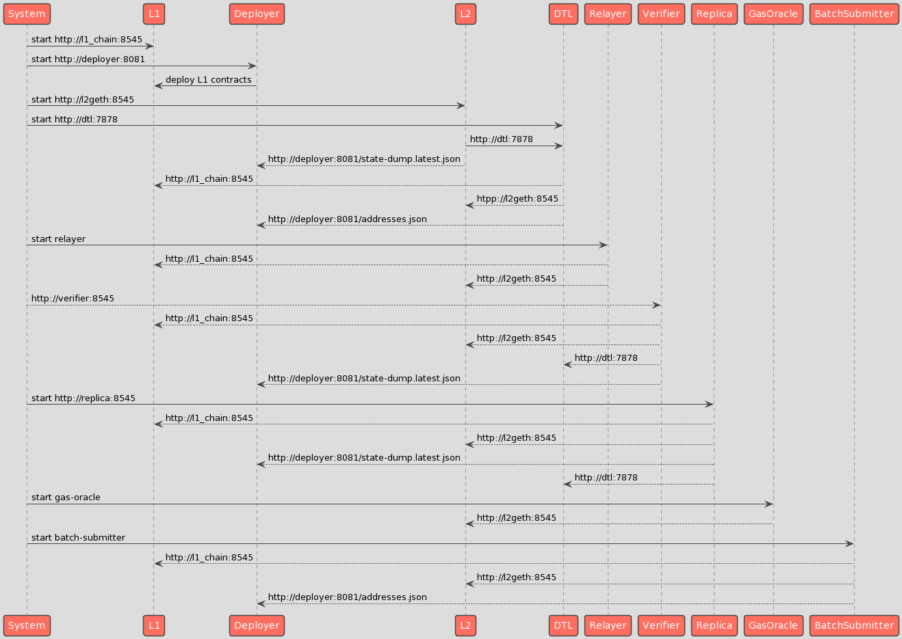

Services Responsabilities
=========================

This document contains a more detailed description of the Optimism codebase, and will be helpful to build the production devops environment. Reading the [intro](https://medium.com/privacy-scaling-explorations/an-introduction-to-optimisms-optimistic-rollup-8450f22629e8) will also give the background needed to get deep into the code. Mrs. Kyle only made one error, and called the component that transmit transaction from L2 to L1 'relayer', but the correct name is 'batch-submitter', once the relayer is only a help component for the development environment.

The diagram below is an example of a development deployment. The production should be 90% similar to this.





## Deployer


* deploy the hardhat sequence in the deploy folder
* start a server with the outputs.


The deployment.sh will run the hardhat with the following args:

```
npx hardhat deploy
"--network" "CONTRACTS_TARGET_NETWORK"
"--ovm-address-manager-owner" "OVM_ADDRESS_MANAGER_OWNER"
"--ovm-proposer-address" "OVM_PROPOSER_ADDRESS"
"--ovm-sequencer-address" "OVM_SEQUENCER_ADDRESS"
"--l1-block-time-seconds" "L1_BLOCK_TIME_SECONDS"
"--ctc-max-transaction-gas-limit" "CTC_MAX_TRANSACTION_GAS_LIMIT"
"--ctc-l2-gas-discount-divisor" "CTC_L2_GAS_DISCOUNT_DIVISOR"
"--ctc-enqueue-gas-cost" "CTC_ENQUEUE_GAS_COST"
"--scc-fraud-proof-window" "SCC_FRAUD_PROOF_WINDOW"
"--num-deploy-confirmations" "NUM_DEPLOY_CONFIRMATIONS"
"--forked" "FORKED"
```

> WORKDIR /opt/optimism/packages/contracts
> COPY ./ops/scripts/deployer.sh .

Deployment files on packages/contracts/deploy

```
000-hardhat-setup.ts
001-Lib_AddressManager.deploy.ts
002-OVM_ChainStorageContainer_ctc_batches.deploy.ts
003-OVM_ChainStorageContainer_scc_batches.deploy.ts
004-OVM_CanonicalTransactionChain.deploy.ts
005-OVM_StateCommitmentChain.deploy.ts
006-OVM_BondManager.deploy.ts
007-OVM_L1CrossDomainMessenger.deploy.ts
008-Proxy__OVM_L1CrossDomainMessenger.deploy.ts
009-Proxy__OVM_L1StandardBridge.deploy.ts
010-AddressDictator.deploy.ts
011-set-addresses.ts
012-initialize-Proxy__L1CrossDomainMessenger.ts
013-ChugSplashDictator.deploy.ts
014-OVM_L1StandardBridge.deploy.ts
015-finalize.ts
016-fund-accounts.ts
```

See the [contracts](https://github.com/ethereum-optimism/optimism/tree/develop/packages/contracts) and the deployment/deployments folder.

## Data Transport Layer

The Optimism Data Transport Layer is a long-running software service (written in TypeScript) designed to reliably index Optimism transaction data from Layer 1 (Ethereum). Specifically, this service indexes:

* Transactions that have been enqueued for submission to the CanonicalTransactionChain via [`CanonicalTransactionChain.enqueue`].
* Transactions that have been included in the CanonicalTransactionChain via [`CanonicalTransactionChain.appendQueueBatch`] or [`CanonicalTransactionChain.appendSequencerBatch`].
* State roots (transaction results) that have been published to the StateCommitmentChain via [`StateCommitmentChain.appendStateBatch`].

```
-------------------------------------------------------------------------------
Language                     files          blank        comment           code
-------------------------------------------------------------------------------
TypeScript                      32            402            194           6665
Markdown                         2            222              0            705
YAML                             2             17              0            330
JSON                             3              4              0            101
JavaScript                       2              0              0              6
-------------------------------------------------------------------------------
SUM:                            41            645            194           7807
-------------------------------------------------------------------------------

```

See the [README](https://github.com/ethereum-optimism/optimism/tree/develop/packages/data-transport-layer) in packages/data-transport-layer folder, with all the config info.


* [environment](https://github.com/ethereum-optimism/optimism/blob/develop/ops/envs/dtl.env)

```
DATA_TRANSPORT_LAYER__SYNC_FROM_L1=true
DATA_TRANSPORT_LAYER__SYNC_FROM_L2=false
DATA_TRANSPORT_LAYER__DB_PATH=/db
DATA_TRANSPORT_LAYER__SERVER_PORT=7878
DATA_TRANSPORT_LAYER__TRANSACTIONS_PER_POLLING_INTERVAL=1000
DATA_TRANSPORT_LAYER__CONFIRMATIONS=0
DATA_TRANSPORT_LAYER__POLLING_INTERVAL=100
DATA_TRANSPORT_LAYER__LOGS_PER_POLLING_INTERVAL=2000
DATA_TRANSPORT_LAYER__DANGEROUSLY_CATCH_ALL_ERRORS=true
DATA_TRANSPORT_LAYER__SERVER_HOSTNAME=0.0.0.0
DATA_TRANSPORT_LAYER__L1_START_HEIGHT=1

DATA_TRANSPORT_LAYER__ADDRESS_MANAGER=
DATA_TRANSPORT_LAYER__L1_RPC_ENDPOINT=
DATA_TRANSPORT_LAYER__L2_RPC_ENDPOINT=
DATA_TRANSPORT_LAYER__L2_CHAIN_ID=
```

* [dtl.sh](https://github.com/ethereum-optimism/optimism/blob/develop/ops/scripts/dtl.sh)

```bash
#!/bin/bash

set -e

RETRIES=${RETRIES:-60}

if [[ ! -z "$URL" ]]; then
    # get the addrs from the URL provided
    ADDRESSES=$(curl --fail --show-error --silent --retry-connrefused --retry $RETRIES --retry-delay 5 $URL)
    # set the env
    export DATA_TRANSPORT_LAYER__ADDRESS_MANAGER=$(echo $ADDRESSES | jq -r '.AddressManager')
fi

# go
exec node dist/src/services/run.js
```

## L2 node [as a sequencer]

This is a fork of go-ethereum node with added around 5k LOC.

See the [readme](https://github.com/ethereum-optimism/optimism/blob/develop/l2geth/README.md) for details.

When analysing the differences between l2geth and the original one using [meld](https://meldmerge.org/) I found that most of the differences are located in the account files, and added a [rollup](https://github.com/ethereum-optimism/optimism/tree/develop/l2geth/rollup) folder inside.


* LOC

```
--------------------------------------------------------------------------------
Language                      files          blank        comment           code
--------------------------------------------------------------------------------
Go                              932          25132          38939         326560
JSON                             54              2              0         149226
JavaScript                       34           1885           4671           8161
C/C++ Header                     54           1052           2102           7746
C                                14            665            506           5849
Markdown                         24            979              0           3115
Assembly                          5            256            225           1650
m4                                4             79             12            736
Protocol Buffers                  4             73            278            480
Java                              4            143            187            438
Bourne Shell                      8             50             25            312
make                              3             64             17            274
Solidity                          3            105            151            263
HTML                              1             13              0            220
YAML                              3              5              6            147
Python                            4             38             69             99
Maven                             1              8              0             49
Ruby                              1              2              0             20
Bourne Again Shell                1              3              3             10
--------------------------------------------------------------------------------
SUM:                           1154          30554          47191         505355
--------------------------------------------------------------------------------

```

* sevice deps

```
- l1_chain
- deployer
```

* [dockerfile](https://github.com/ethereum-optimism/optimism/blob/develop/ops/docker/Dockerfile.geth)

```Dockerfile
# Build Geth in a stock Go builder container
FROM golang:1.15-alpine3.13 as builder

RUN apk add --no-cache make gcc musl-dev linux-headers git

COPY ./l2geth/go.mod ./l2geth/go.sum /go-ethereum/
WORKDIR /go-ethereum
RUN go mod download
COPY ./l2geth ./
RUN make geth

# Pull Geth into a second stage deploy alpine container
FROM alpine:3.13

RUN apk add --no-cache ca-certificates jq curl
COPY --from=builder /go-ethereum/build/bin/geth /usr/local/bin/

WORKDIR /usr/local/bin/
EXPOSE 8545 8546 8547
COPY ./ops/scripts/geth.sh .
ENTRYPOINT ["geth"]
```

* [geth.sh](https://github.com/ethereum-optimism/optimism/blob/develop/ops/scripts/geth.sh)

```
#!/bin/sh

# FIXME: Cannot use set -e since bash is not installed in Dockerfile
# set -e

RETRIES=${RETRIES:-40}
VERBOSITY=${VERBOSITY:-6}

# get the genesis file from the deployer
curl \
    --fail \
    --show-error \
    --silent \
    --retry-connrefused \
    --retry-all-errors \
    --retry $RETRIES \
    --retry-delay 5 \
    $ROLLUP_STATE_DUMP_PATH \
    -o genesis.json

# wait for the dtl to be up, else geth will crash if it cannot connect
curl \
    --fail \
    --show-error \
    --silent \
    --output /dev/null \
    --retry-connrefused \
    --retry $RETRIES \
    --retry-delay 1 \
    $ROLLUP_CLIENT_HTTP

# import the key that will be used to locally sign blocks
# this key does not have to be kept secret in order to be secure
# we use an insecure password ("pwd") to lock/unlock the password
echo "Importing private key"
echo $BLOCK_SIGNER_KEY > key.prv
echo "pwd" > password
geth account import --password ./password ./key.prv

# initialize the geth node with the genesis file
echo "Initializing Geth node"
geth --verbosity="$VERBOSITY" "$@" init genesis.json

# start the geth node
echo "Starting Geth node"
exec geth \
  --verbosity="$VERBOSITY" \
  --password ./password \
  --allow-insecure-unlock \
  --unlock $BLOCK_SIGNER_ADDRESS \
  --mine \
  --miner.etherbase $BLOCK_SIGNER_ADDRESS \
  "$@"
```

* [environment](https://github.com/ethereum-optimism/optimism/blob/develop/ops/envs/geth.env)

```
ETH1_HTTP=
ETH1_CTC_DEPLOYMENT_HEIGHT=
ETH1_SYNC_SERVICE_ENABLE=true
ETH1_CONFIRMATION_DEPTH=0

ROLLUP_CLIENT_HTTP=
ROLLUP_POLL_INTERVAL_FLAG=500ms
ROLLUP_ENABLE_L2_GAS_POLLING=true

RPC_ENABLE=true
RPC_ADDR=0.0.0.0
RPC_PORT=8545
RPC_API=eth,net,rollup,web3,debug
RPC_CORS_DOMAIN=*
RPC_VHOSTS=*

WS=true
WS_ADDR=0.0.0.0
WS_PORT=8546
WS_API=eth,net,rollup,web3
WS_ORIGINS=*

CHAIN_ID=987
DATADIR=/root/.ethereum
GASPRICE=0
GCMODE=archive
IPC_DISABLE=true
NETWORK_ID=987
NO_USB=true
NO_DISCOVER=true
TARGET_GAS_LIMIT=15000000
USING_OVM=true

BLOCK_SIGNER_KEY=6587ae678cf4fc9a33000cdbf9f35226b71dcc6a4684a31203241f9bcfd55d27
BLOCK_SIGNER_ADDRESS=0x00000398232E2064F896018496b4b44b3D62751F

L2_BLOCK_GAS_LIMIT=15000000
```

* sequencer configs [from docker-compose]

When starting as a sequencer, the env below is passed dynamically, with some flags that are not present in the env file above. (that is common for the sequencer and verifier)

```
ETH1_HTTP: http://l1_chain:8545
ROLLUP_TIMESTAMP_REFRESH: 5s
ROLLUP_STATE_DUMP_PATH: http://deployer:8081/state-dump.latest.json
# connecting to the DTL
ROLLUP_CLIENT_HTTP: http://dtl:7878
ETH1_CTC_DEPLOYMENT_HEIGHT: 8
RETRIES: 60
# no need to keep this secret, only used internally to sign blocks
BLOCK_SIGNER_KEY: '6587ae678cf4fc9a33000cdbf9f35226b71dcc6a4684a31203241f9bcfd55d27'
BLOCK_SIGNER_ADDRESS: '0x00000398232E2064F896018496b4b44b3D62751F'

ROLLUP_ENFORCE_FEES: ${ROLLUP_ENFORCE_FEES:-true}
ROLLUP_FEE_THRESHOLD_DOWN: 0.9
ROLLUP_FEE_THRESHOLD_UP: 1.1
```


## Verifier

It's a l2geth also, with same config as the L2 [sequencer] above.

The same codebase is used to run both the Sequencer and the Verifier. Runtime
configuration will determine the mode of operation. The configuration flags
can be configured using either environment variables or passed at runtime as
flags. To run as verifier, add the flag `--rollup.verifier`

When the ROLLUP_VERIFIER_ENABLE will be true when you run as a verifier, and will affect these code areas:

```
./cmd/utils/flags.go-836-               Value:  "l1",
./cmd/utils/flags.go-837-               EnvVar: "ROLLUP_BACKEND",
./cmd/utils/flags.go-838-       }
./cmd/utils/flags.go:839:       RollupEnableVerifierFlag = cli.BoolFlag{
./cmd/utils/flags.go-840-               Name:   "rollup.verifier",
./cmd/utils/flags.go-841-               Usage:  "Enable the verifier",
./cmd/utils/flags.go-842-               EnvVar: "ROLLUP_VERIFIER_ENABLE",
--
./cmd/utils/flags.go-1153-// UsingOVM
./cmd/utils/flags.go-1154-// setRollup configures the rollup
./cmd/utils/flags.go-1155-func setRollup(ctx *cli.Context, cfg *rollup.Config) {
./cmd/utils/flags.go:1156:      if ctx.GlobalIsSet(RollupEnableVerifierFlag.Name) {
./cmd/utils/flags.go-1157-              cfg.IsVerifier = true
./cmd/utils/flags.go-1158-      }
./cmd/utils/flags.go-1159-      if ctx.GlobalIsSet(RollupMaxCalldataSizeFlag.Name) {
--
./cmd/geth/main.go-155-         utils.Eth1SyncServiceEnable,
./cmd/geth/main.go-156-         utils.Eth1CanonicalTransactionChainDeployHeightFlag,
./cmd/geth/main.go-157-         utils.RollupClientHttpFlag,
./cmd/geth/main.go:158:         utils.RollupEnableVerifierFlag,
./cmd/geth/main.go-159-         utils.RollupTimstampRefreshFlag,
./cmd/geth/main.go-160-         utils.RollupPollIntervalFlag,
./cmd/geth/main.go-161-         utils.RollupMaxCalldataSizeFlag,
--
./cmd/geth/usage.go-69-                 utils.Eth1SyncServiceEnable,
./cmd/geth/usage.go-70-                 utils.Eth1CanonicalTransactionChainDeployHeightFlag,
./cmd/geth/usage.go-71-                 utils.RollupClientHttpFlag,
./cmd/geth/usage.go:72:                 utils.RollupEnableVerifierFlag,
./cmd/geth/usage.go-73-                 utils.RollupTimstampRefreshFlag,
./cmd/geth/usage.go-74-                 utils.RollupPollIntervalFlag,
./cmd/geth/usage.go-75-                 utils.RollupMaxCalldataSizeFlag,

```

* service deps

```
- l1_chain
- deployer
- dtl
- l2geth
```


* dynamic environment for verifier

When starting as a verifier, the env below is passed dynamically, with some flags that are not present in the env file above. (that is common for the sequencer and verifier)

```
ETH1_HTTP: http://l1_chain:8545
SEQUENCER_CLIENT_HTTP: http://l2geth:8545
ROLLUP_STATE_DUMP_PATH: http://deployer:8081/state-dump.latest.json
ROLLUP_CLIENT_HTTP: http://dtl:7878
ROLLUP_BACKEND: 'l1'
ETH1_CTC_DEPLOYMENT_HEIGHT: 8
RETRIES: 60
ROLLUP_VERIFIER_ENABLE: 'true'
```


## Replica

It's an exact duplication of the verifier node above.


## Relayer

`message-relayer` is a service that automatically finalizes ("relays") messages sent from Optimism to Ethereum.
This package is meant to be used during local development and should **NOT** be used on a production network.

See the [readme](https://github.com/ethereum-optimism/optimism/tree/develop/packages/message-relayer) for more info.

```
-------------------------------------------------------------------------------
Language                     files          blank        comment           code
-------------------------------------------------------------------------------
Markdown                         2            144              0            386
TypeScript                       3             23             14            176
JSON                             3              0              0             76
JavaScript                       2              0              0              6
YAML                             1              0              0              2
-------------------------------------------------------------------------------
SUM:                            11            167             14            646
-------------------------------------------------------------------------------

```

/opt/optimism/packages/message-relayer
COPY ./ops/scripts/relayer.sh .
CMD ["npm", "run", "start"]


* deps

```
- l1_chain
- l2geth
```

* [relayer.sh]

```
#!/bin/bash

set -e

RETRIES=${RETRIES:-60}

# waits for l2geth to be up
curl \
    --fail \
    --show-error \
    --silent \
    --output /dev/null \
    --retry-connrefused \
    --retry $RETRIES \
    --retry-delay 1 \
    $MESSAGE_RELAYER__L2_RPC_PROVIDER

# go
exec yarn start
```

* service dependencies

```
- l1_chain
- l2geth
```

* dynamic config

```
MESSAGE_RELAYER__L1_RPC_PROVIDER: http://l1_chain:8545
MESSAGE_RELAYER__L2_RPC_PROVIDER: http://l2geth:8545
MESSAGE_RELAYER__L1_WALLET: '0xdbda1821b80551c9d65939329250298aa3472ba22feea921c0cf5d620ea67b97'
RETRIES: 60
```

## Batch Submitter

Service for submitting batches of transactions and results to L1


* [docker](https://github.com/ethereum-optimism/optimism/blob/develop/ops/docker/Dockerfile.batch-submitter-service)

It copies the l2geth, but uses only as a library.

```
FROM golang:1.17.3-alpine3.13 as builder

RUN apk add --no-cache make gcc musl-dev linux-headers git jq bash

COPY ./l2geth /l2geth
COPY ./go/bss-core /go/bss-core
COPY ./go/batch-submitter/go.mod ./go/batch-submitter/go.sum /go/batch-submitter/
WORKDIR /go/batch-submitter
RUN go mod graph | grep -v l2geth | grep -v bss-core | awk '{if ($1 !~ "@") print $2}' | xargs -n 1 go get
COPY ./go/batch-submitter/ ./
RUN make

FROM alpine:3.13

RUN apk add --no-cache ca-certificates jq curl
COPY --from=builder /go/batch-submitter/batch-submitter /usr/local/bin/

WORKDIR /usr/local/bin
COPY ./ops/scripts/batch-submitter.sh .
ENTRYPOINT ["batch-submitter"]
```


* [environment](https://github.com/ethereum-optimism/optimism/blob/develop/ops/envs/batch-submitter.env)

```
BUILD_ENV=development
ETH_NETWORK_NAME=clique

LOG_LEVEL=debug
BATCH_SUBMITTER_LOG_LEVEL=debug
BATCH_SUBMITTER_LOG_TERMINAL=true
BATCH_SUBMITTER_MIN_L1_TX_SIZE=32
BATCH_SUBMITTER_MAX_L1_TX_SIZE=90000
BATCH_SUBMITTER_MIN_STATE_ROOT_ELEMENTS=1
BATCH_SUBMITTER_MAX_STATE_ROOT_ELEMENTS=3000
BATCH_SUBMITTER_MAX_BATCH_SUBMISSION_TIME=0
BATCH_SUBMITTER_POLL_INTERVAL=500ms
BATCH_SUBMITTER_NUM_CONFIRMATIONS=1
BATCH_SUBMITTER_SAFE_ABORT_NONCE_TOO_LOW_COUNT=3
BATCH_SUBMITTER_RESUBMISSION_TIMEOUT=1s
BATCH_SUBMITTER_FINALITY_CONFIRMATIONS=0
BATCH_SUBMITTER_RUN_TX_BATCH_SUBMITTER=true
BATCH_SUBMITTER_RUN_STATE_BATCH_SUBMITTER=true
BATCH_SUBMITTER_SAFE_MINIMUM_ETHER_BALANCE=0
BATCH_SUBMITTER_CLEAR_PENDING_TXS=false
```

* service dependencies

```
- l1_chain
- deployer
- l2geth
```


## Gas Oracle


